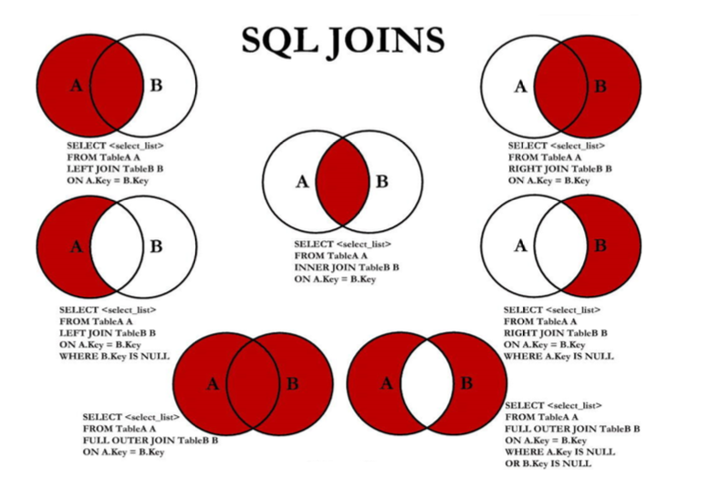

### 多表查询

多表查询，也称为关联查询，指两个或多个表一起完成查询操作

前提条件：这些一起查询的表之间是有关系的（一对一、一对多），它们之间一定是有关联字段，这个关联字段可能建立了外键，也有可能没有建立外键。比如：员工表和部门表，这两个表依靠部门编号进行关联

```sql
SELECT emp.employee_id,emp.last_name,dep.department_id,dep.department_name
FROM employees AS emp,departments AS dep;
```

> 我们把上述多表查询中出现的问题称为：笛卡尔积的错误

#### 笛卡尔积（交叉连接）的理解

笛卡尔乘积是一个数学运算。假设我有两个集合 X 和 Y，那么 X 和 Y 的笛卡尔积就是 X 和 Y 的所有可能 组合，也就是第一个对象来自于 X，第二个对象来自于 Y 的所有可能。组合的个数即为两个集合中元素 个数的乘积数。

SQL92中，笛卡尔积也称为 交叉连接 ，英文是 CROSS JOIN 。在 SQL99 中也是使用 CROSS JOIN表示交叉连接。它的作用就是可以把任意表进行连接，即使这两张表不相关。在MySQL中会出现笛卡尔积。

#### 避免笛卡尔积

```sql
#查询员工姓名和所在部门名称
SELECT emp.last_name,dep.department_name
FROM employees AS emp,departments AS dep
WHERE emp.department_id = dep.department_id;

SELECT e.last_name,d.department_name
FROM employees AS e JOIN departments AS d 
ON e.department_id = d.department_id;
```

#### 多表查询分类

#### 等值连接vs非等值连接

**等值连接**

- 多个连接条件与AND操作符
- 区分重复的列名
  - 多表中有相同的列名时，必须在列名之前加上表名前缀
  - 在不同 的表中具有相同的列名的列可以用表名加以区分
- 表的别名
  - 使用别名可以简化查询
  - 列名前使用表名前缀可以提高查询效率

```sql
#查询员工姓名、员工部门名称、员工所在城市
SELECT e.last_name,d.department_name,l.city
FROM employees AS e,departments AS d, locations AS l
WHERE e.department_id = d.department_id 
AND d.location_id = l.location_id;

SELECT  e.last_name,d.department_name,l.city
FROM employees AS e JOIN departments AS d 
ON e.department_id = d.department_id 
JOIN locations AS l ON d.location_id = l.location_id;
```

> 注意：
>
> - 如果是我们使用了表的别名，在查询字段中、过滤条件中就只能使用别名进行代替，不能使用原有的表名，否则会报错
>
> - 对于数据库中表记录的查询和变更，只要涉及多个表，都需要在列名前加表的别名(或表名)进行限定。
> - 对多表进行查询记录、更新记录、删除记录时，如果对操作列没有限定表的别名(或表 名)，并且操作列在多个表中存在时，就会抛异常。

**非等值连接**

```sql
#查询员工对应工资等级
SELECT e.last_name,e.salary,j.grade_level
FROM employees e, job_grades j
WHERE e.salary BETWEEN j.lowest_sal AND j.highest_sal;

SELECT e.last_name,e.salary,j.grade_level
FROM employees e JOIN job_grades j
ON e.salary BETWEEN j.lowest_sal AND j.highest_sal;
```

#### 自连接vs非自连接

- 当table1和table2本质上是同一张表，只是用取别名的方式虚拟成两张表以代表不同的意义。然后两个表再进行内连接，外连接等查询。

```sql
#查询员工ID、姓名、上级ID、上级姓名
SELECT e1.employee_id,e1.last_name,e2.employee_id,e2.last_name
FROM employees e1, employees e2
WHERE e1.manager_id = e2.employee_id;

SELECT e1.employee_id,e1.last_name,e2.employee_id,e2.last_name
FROM employees e1 JOIN employees e2
ON e1.manager_id = e2.employee_id;

#查询出last_name为 ‘Chen’ 的员工的 manager 的信息。
SELECT e1.last_name,e2.last_name AS "员工领导"
FROM employees e1,employees e2  WHERE e1.last_name = "Chen"
AND e1.manager_id = e2.employee_id;
```

#### 内连接vs外连接

除了查询满足条件的记录以外，外连接还可以查询某一方不满足条件的记录

- 内连接：合并具有同一列的两个以上的表的行，结果集中不包含一个表与另一个表不匹配的行
- 外连接：两个表在连接过程中除了返回满足连接条件的行以外还返回左或右表中不满足条件的行，称为左或右外连接。没有匹配的行时，结果表中相应的列为空(NULL)
- 如果是左外连接，则连接条件中左边的表也称为主表，右边的表称为从表
- 如果是右外连接，则连接条件中右边的表也称为主表，左边的表称为从表

**内连接**

```sql
#INNER可以省略
SELECT e.last_name,d.department_name
FROM employees e INNER JOIN departments d 
ON e.department_id = d.department_id;

#查询员工ID、姓名、部门、城市
SELECT e.employee_id, e.last_name,d.department_name,l.city
FROM employees e JOIN departments d 
ON e.department_id = d.department_id
JOIN locations l ON d.location_id = l.location_id;
```

**外连接(OUTER JOIN)**

- 左外连接（LEFT OUTER JOIN）

```sql
#左连接查询员工的部门信息
SELECT e.employee_id,e.last_name,d.department_name
FROM employees e LEFT JOIN departments d
ON e.department_id = d.department_id
```

- 右外连接（RIGTH OUTER JOIN）

```sql
#右外连接查询员工部门信息
SELECT  e.employee_id,e.last_name,d.department_name
FROM employees e RIGHT JOIN departments d 
ON e.department_id = d.department_id;
```

- 满外连接（FULL OUTER JOIN）

```sql
#满外连接
SELECT e.employee_id,e.last_name,d.department_name
FROM employees e LEFT JOIN departments d
ON e.department_id = d.department_id
UNION
SELECT  e.employee_id,e.last_name,d.department_name
FROM employees e RIGHT JOIN departments d 
ON e.department_id = d.department_id;
```

#### UNION的使用

合并查询结果利用UNION关键字，可以给出多条SELECT语句，并将它们的结果组合成单个结果集。合并时，两个表对应的列数和数据类型必须相同，并且互相对应。各个SELECT语句之间使用UNION或UNION ALL关键字分隔。

语法格式：

```sql
SELECT column,... FROM table1
UNION [ALL]
SELECT column,... FROM table2
```

#### 7种SQL JOINS的实现



```sql
#内连接中间图
SELECT e.last_name,d.department_name
FROM employees e JOIN departments d
ON e.department_id = d.department_id;
#左外连接左上图
SELECT e.last_name,d.department_name
FROM employees e LEFT JOIN departments d 
ON e.department_id = d.department_id
#右外连接右上图
SELECT e.last_name,d.department_name
FROM employees e RIGHT JOIN departments d 
ON e.department_id = d.department_id;
#左中图排除查询A表中去除B表重复剩下的数据
SELECT e.last_name,d.department_name
FROM employees e LEFT JOIN departments d 
ON e.department_id = d.department_id
WHERE e.department_id IS NULL;
#右中图查询B表中除去A表重复剩下的数据
SELECT e.last_name,d.department_name
FROM employees e RIGHT JOIN departments d
ON e.department_id = d.department_id
WHERE e.department_id IS NULL;
#右下图
SELECT e.last_name,d.department_name
FROM employees e LEFT JOIN departments d 
ON e.department_id = d.department_id
WHERE e.department_id is NULL
UNION ALL
SELECT e.last_name,d.department_name
FROM employees e RIGHT JOIN departments d 
ON e.department_id = d.department_id
WHERE e.department_id IS NULL;
#左下图:满外连接
SELECT e.last_name,d.department_name
FROM employees e RIGHT JOIN departments d 
ON e.department_id = d.department_id
UNION ALL
SELECT e.last_name,d.department_name
FROM employees e LEFT JOIN departments d 
ON e.department_id = d.department_id
WHERE e.department_id IS NULL;
```

